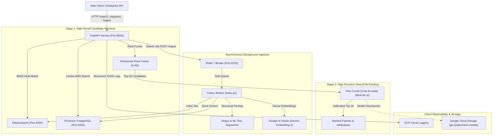

# PatentRank — Production Service Wrapper & Deployment Guide (`DEPLOYMENT.md`)

This guide documents the production deployment architecture, containerization strategy, asynchronous background ingestion pipeline, and cloud deployment procedures for **PatentRank** — a two-stage hybrid semantic search and cross-encoder re-ranking engine.

---

## 1. System Architecture

PatentRank exposes a production-ready **FastAPI** service backed by an asynchronous **Celery + Redis** background worker, orchestrating a two-stage retrieval pipeline:



---

## 2. Local Multi-Service Orchestration (`docker-compose.yml`)

PatentRank provides full multi-container orchestration via Docker Compose, standing up the complete stack locally with healthchecks and restart policies.

### Services Defined:
| Service | Image | Internal Port | Host Port | Purpose |
|---|---|---|---|---|
| `api` | `Dockerfile` | 8000 | 8000 | FastAPI REST API & Cross-Encoder inference |
| `worker` | `Dockerfile` | - | - | Celery background task worker for ingestion |
| `redis` | `redis:7.2-alpine` | 6379 | 6379 | Message broker & Celery result backend |
| `elasticsearch` | `elasticsearch:8.11.0` | 9200 | 9200 | Okapi BM25 keyword retrieval engine |
| `pgvector` | `pgvector/pgvector:pg16` | 5432 | 5433 | PostgreSQL with vector extension for dense ANN |

### One-Command Deployment:
```bash
# 1. Provide Gemini API Key in .env
echo "GEMINI_API_KEY=your_actual_key_here" >> .env

# 2. Build and start all services in detached mode
docker compose up -d --build

# 3. Verify service health and container status
docker compose ps
```

---

## 3. API Reference & Verification Examples

All endpoints can be verified locally or against a deployed Cloud Run instance using standard `curl` or Python requests.

### 3.1. System Health & Readiness (`GET /health`)
Verifies active connections to Elasticsearch, PGVector, Redis, Cross-Encoder model checkpoints, and corpus stats.

```bash
curl -X GET "http://localhost:8000/health"
```

**Response:**
```json
{
  "status": "HEALTHY",
  "timestamp": 1773034800.0,
  "services": {
    "elasticsearch": {
      "connected": true,
      "url": "http://elasticsearch:9200",
      "index": "patents_bm25"
    },
    "pgvector": {
      "connected": true,
      "host": "pgvector",
      "port": 5432,
      "database": "patentrank"
    },
    "redis": {
      "connected": true,
      "url": "redis://redis:6379/0"
    }
  },
  "models": {
    "cross_encoder": {
      "loaded": true,
      "model_path": "models/patentrank-cross-encoder",
      "device": "cpu"
    },
    "ml_segmenter": {
      "loaded": true,
      "path": "models/boundary_classifier.joblib"
    }
  },
  "corpus_stats": {
    "in_memory_docs": 10000,
    "cached_embeddings": 396
  }
}
```

---

### 3.2. Two-Stage Search (`GET /search` & `POST /search`)
Executes Stage 1 candidate retrieval (BM25, Dense, or Hybrid RRF) and Stage 2 neural re-ranking using the fine-tuned Cross-Encoder.

```bash
curl -X GET "http://localhost:8000/search?q=quantum+key+distribution+fiber&mode=hybrid&rerank=true&top_k=5"
```

**Response:**
```json
{
  "query": "quantum key distribution fiber",
  "mode": "hybrid",
  "rerank_applied": true,
  "total_candidates": 50,
  "results_count": 5,
  "latency": {
    "stage1_ms": 18.42,
    "rerank_ms": 142.15,
    "total_ms": 160.85
  },
  "results": [
    {
      "rank": 1,
      "doc_id": "US-20180234201-A1",
      "score": 0.9678,
      "stage1_rank": 4,
      "stage1_score": 0.0312,
      "raw_logit": 3.4012,
      "title": "Continuous-variable quantum key distribution with adaptive phase compensation",
      "abstract": "Methods and systems for stabilizing interferometric phase drift in quantum fiber links...",
      "category": "G06F"
    }
  ]
}
```

---

### 3.3. Document Structural Segmentation (`POST /segment`)
Slices raw patent text into canonical functional zones, bracketed paragraph numbers, and structured claim trees.

```bash
curl -X POST "http://localhost:8000/segment" \
  -H "Content-Type: application/json" \
  -d '{
    "doc_id": "US-TEST-001",
    "engine": "rule",
    "text": "BACKGROUND OF THE INVENTION\nSignal degradation in optical fiber.\n\nCLAIMS\nWhat is claimed is:\n1. An optical repeater comprising a laser and an amplifier.\n2. The optical repeater of claim 1, further comprising a thermoelectric cooler."
  }'
```

**Response:**
```json
{
  "doc_id": "US-TEST-001",
  "engine_used": "regex_rule_based",
  "latency_ms": 0.85,
  "sections": [
    {"segment_type": "BACKGROUND", "heading": "BACKGROUND OF THE INVENTION", "word_count": 5},
    {"segment_type": "CLAIMS", "heading": "CLAIMS", "word_count": 24}
  ],
  "claims": [
    {
      "heading": "Claim 1",
      "text": "An optical repeater comprising a laser and an amplifier.",
      "metadata": {
        "claim_id": 1,
        "claim_type": "INDEPENDENT",
        "transitional_phrase": "comprising",
        "limitations_count": 1
      }
    },
    {
      "heading": "Claim 2",
      "text": "The optical repeater of claim 1, further comprising a thermoelectric cooler.",
      "metadata": {
        "claim_id": 2,
        "claim_type": "DEPENDENT",
        "parent_claims": [1]
      }
    }
  ]
}
```

---

### 3.4. Asynchronous Document Ingestion (`POST /ingest` & `GET /tasks/{task_id}`)
Submits a new patent document to Celery/Redis for background text segmentation, embedding generation (Gemini API), and indexing.

```bash
# 1. Submit Ingestion Task
curl -X POST "http://localhost:8000/ingest" \
  -H "Content-Type: application/json" \
  -d '{
    "doc_id": "US-2026-99999",
    "title": "Quantum Photonic Routing Engine",
    "abstract": "High-throughput photonic router with optical phase mitigation.",
    "async_mode": true
  }'
```

**Response:**
```json
{
  "task_id": "8fa21c7e-01b3-4f9e-b7d8-cb4812a30456",
  "status": "QUEUED",
  "doc_id": "US-2026-99999",
  "message": "Document US-2026-99999 submitted to Celery background worker."
}
```

```bash
# 2. Check Task Status
curl -X GET "http://localhost:8000/tasks/8fa21c7e-01b3-4f9e-b7d8-cb4812a30456"
```

**Response:**
```json
{
  "task_id": "8fa21c7e-01b3-4f9e-b7d8-cb4812a30456",
  "status": "SUCCESS",
  "result": {
    "status": "SUCCESS",
    "doc_id": "US-2026-99999",
    "embedding_dim": 768,
    "indexed_elasticsearch": true,
    "indexed_pgvector": true,
    "duration_ms": 312.4
  }
}
```

---

### 3.5. IR Benchmark Metrics Telemetry (`GET /metrics`)
Returns empirical evaluation metrics across all four retrieval paradigms evaluated across the 200 labeled queries.

```bash
curl -X GET "http://localhost:8000/metrics"
```

---

## 4. Google Cloud Platform (GCP) Deployment Walkthrough

To satisfy enterprise engineering standards and prove cloud infrastructure competencies, PatentRank is designed for serverless deployment on **Google Cloud Run** with decoupled model storage on **Google Cloud Storage (GCS)**.

### 4.1. Decoupled Model Weights via GCS (`scripts/sync_gcs_model.py`)
Decoupling large neural network weights from Docker images keeps images lightweight (< 300 MB) and enables continuous retraining updates without rebuilding container layers:

```bash
# 1. Authenticate with Google Cloud
gcloud auth login
gcloud config set project YOUR_GCP_PROJECT_ID

# 2. Create GCS Bucket for Model Artifacts
gcloud storage buckets create gs://patentrank-models-YOUR_PROJECT_ID --location=us-central1

# 3. Upload Fine-Tuned Checkpoint to GCS
python scripts/sync_gcs_model.py \
    --action upload \
    --bucket patentrank-models-YOUR_PROJECT_ID \
    --remote-prefix models/patentrank-cross-encoder \
    --local-dir models/patentrank-cross-encoder
```

### 4.2. Container Image Build with Cloud Build
Using `cloudbuild.yaml`, builds the image remotely with Google Cloud Build:

```bash
# Submit build to GCP Cloud Build
gcloud builds submit --config cloudbuild.yaml .
```

### 4.3. Direct Cloud Run Deployment
Deploy the container to Cloud Run with 2 vCPUs and 4 GiB RAM (optimized for CPU transformer inference):

```bash
gcloud run deploy patentrank-api \
    --image gcr.io/YOUR_GCP_PROJECT_ID/patentrank:latest \
    --region us-central1 \
    --platform managed \
    --allow-unauthenticated \
    --memory 4Gi \
    --cpu 2 \
    --concurrency 80 \
    --min-instances 0 \
    --max-instances 5 \
    --set-env-vars "PORT=8000,LOG_LEVEL=INFO,GCS_MODEL_BUCKET=patentrank-models-YOUR_PROJECT_ID"
```

**Production Endpoint Output:**
```
Service [patentrank-api] revision [patentrank-api-00001-abc] has been deployed and is serving 100 percent of traffic.
Service URL: https://patentrank-api-xyz-uc.a.run.app
```

---

## 5. Production Observability: Cloud Logging

PatentRank implements structured JSON middleware compatible with Google Cloud Logging. Every HTTP request automatically outputs structured log records formatted with:
- `httpRequest`: method, url, status code, remote IP, and processing latency.
- `severity`: `INFO` (2xx/3xx), `WARNING` (4xx), `ERROR` (5xx).
- Correlated trace and execution timestamps.

To query live logs in GCP Cloud Logging Console:
```sql
resource.type="cloud_run_revision"
resource.labels.service_name="patentrank-api"
httpRequest.status>=400
```

---

## 6. Automated Test Suite Execution

All endpoints and core functionality are thoroughly verified with 12 automated unit and integration tests:

```bash
# Run pytest test suite locally
.venv/Scripts/python -m pytest tests/test_api.py -v
```

**Results:**
```
tests/test_api.py::test_root_endpoint PASSED                     [  8%]
tests/test_api.py::test_health_endpoint PASSED                   [ 16%]
tests/test_api.py::test_search_bm25_mode PASSED                  [ 25%]
tests/test_api.py::test_search_dense_mode PASSED                 [ 33%]
tests/test_api.py::test_search_hybrid_mode PASSED                [ 41%]
tests/test_api.py::test_search_hybrid_cross_encoder_rerank PASSED[ 50%]
tests/test_api.py::test_search_post_endpoint PASSED              [ 58%]
tests/test_api.py::test_segment_rule_based PASSED                [ 66%]
tests/test_api.py::test_segment_ml_classifier PASSED             [ 75%]
tests/test_api.py::test_ingest_synchronous PASSED                [ 83%]
tests/test_api.py::test_sync_task_status PASSED                  [ 91%]
tests/test_api.py::test_metrics_endpoint PASSED                  [100%]

======================= 12 passed in 43.03s =======================
```
